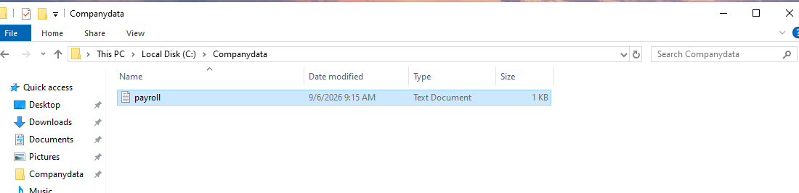
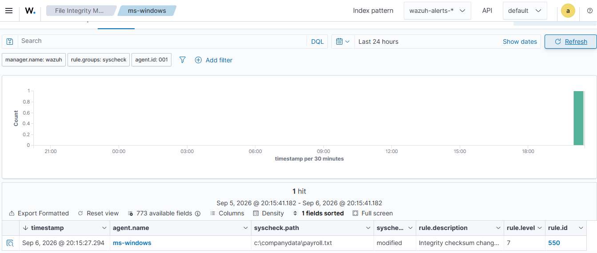
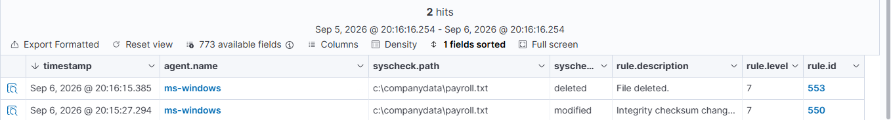
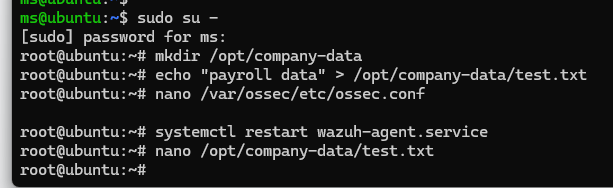
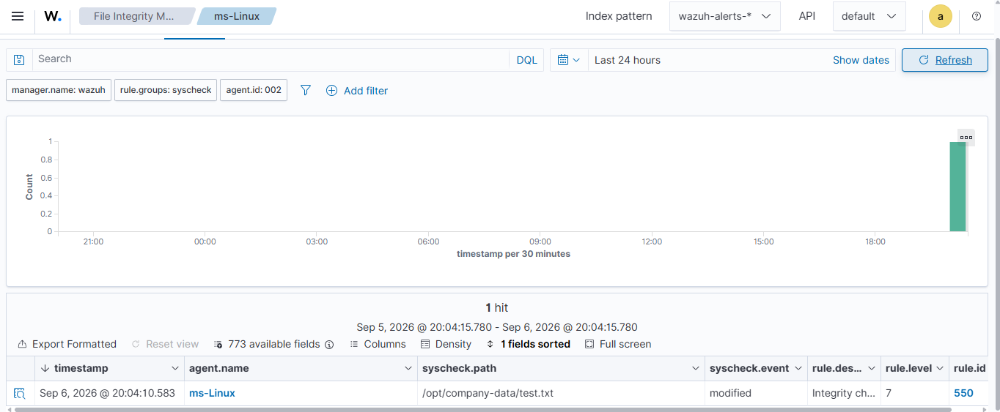
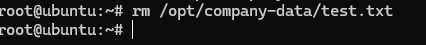
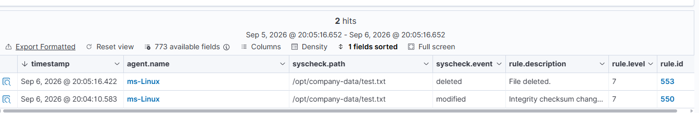
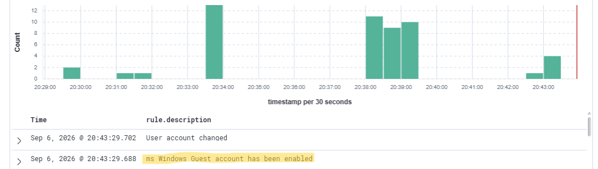

# File Integrity Monitoring & Custom Detection

## Objective

The objective of this stage was to practice File Integrity Monitoring (FIM) on Windows and Ubuntu endpoints and create a custom Wazuh detection rule for Windows Guest account activity.

---

## 1. File Integrity Monitoring

File Integrity Monitoring (FIM) allows Wazuh to detect changes made to monitored files and directories.

For this lab, FIM was configured on both the Windows and Ubuntu endpoints.

### Windows FIM

A test directory was created on the Windows endpoint:

```text
C:\Company Data
```

The directory was configured for real-time file monitoring through the Wazuh agent configuration.

I tested different file operations inside the monitored directory, including:
* Editing files
* Deleting files

The resulting file changes were detected by Wazuh and reflected in the Wazuh Dashboard.







---

### Ubuntu FIM

FIM was also configured on the Ubuntu endpoint.

File changes were tested in the monitored directory by:

* Editing files
* Deleting files

The changes were successfully detected and reflected in Wazuh.









---

## 2. Custom Wazuh Detection Rule

A custom Wazuh rule was created to detect when the Windows **Guest account is enabled**.

The rule monitors Windows Security Event ID `4722`, which indicates that a user account has been enabled.

The rule was configured to specifically identify the `Guest` account.

### Detection Logic

```xml
<rule id="100201" level="10">
    <if_sid>60103</if_sid>
    <field name="win.system.eventID">^4722$</field>
    <field name="win.eventdata.targetUserName">^Guest$</field>
    <description>ms Windows Guest account has been enabled</description>

    <mitre>
        <id>T1098</id>
    </mitre>

    <group>
        windows,
        windows_account_management,
        account_enabled,
        guest_account,
    </group>
</rule>
```

### Test Result

After enabling the Windows Guest account, the corresponding Windows security event was generated and detected by Wazuh.

The custom rule successfully generated an alert in the Wazuh Dashboard.



---
