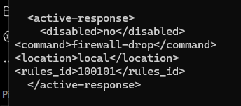
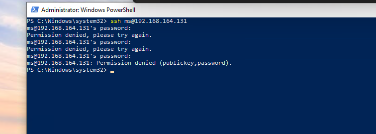
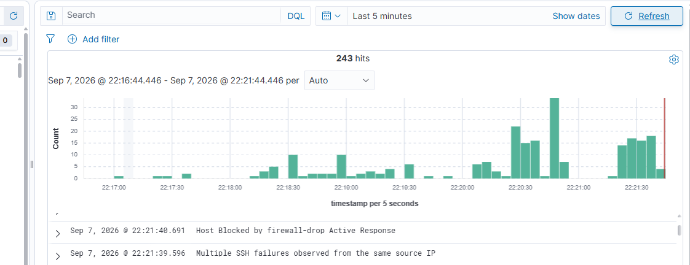
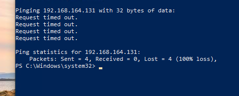

# Active Response & SSH Brute-Force Detection

## Objective

The objective of this stage was to create a custom Wazuh detection rule for repeated SSH authentication failures and configure Active Response to respond to detected activity.

---

## 1. Custom SSH Detection Rule

A custom Wazuh rule was created to detect multiple failed SSH authentication attempts from the same source IP.

The rule triggers when three matching SSH authentication failures are observed from the same source IP within 120 seconds.

```xml
<group name="local,syslog,sshd,authentication_failed,">
    <rule id="100101" level="10" frequency="3" timeframe="120">
        <if_matched_sid>5760</if_matched_sid>
        <same_source_ip />
        <description>Multiple SSH failures observed from the same source IP</description>

        <mitre>
            <id>T1110</id>
        </mitre>

        <group>
            authentication_failed,
            ssh_bruteforce,
            credential_access,
        </group>
    </rule>
</group>
```

### Detection Logic

| Parameter |         Value | Purpose                                  |
| --------- | ------------: | ---------------------------------------- |
| Rule ID   |      `100101` | Custom rule identifier                   |
| Level     |          `10` | High-severity alert level                |
| Frequency |           `3` | Requires three matching events           |
| Timeframe | `120 seconds` | Events must occur within two minutes     |
| Source IP |          Same | Correlates failures from the same source |

The rule is mapped to **MITRE ATT&CK T1110 — Brute Force**.

---

## 2. Active Response Configuration

Wazuh Active Response was configured through the Wazuh server configuration.

The configuration was used to allow Wazuh to take an automated response when the relevant detection condition was met.



---

## 3. SSH Authentication Failure Test

A controlled test was performed from the Windows endpoint against the Ubuntu endpoint by generating multiple failed SSH login attempts.

The failed authentication activity was detected by Wazuh and the custom rule generated an alert.





The alert demonstrated that Wazuh was able to correlate multiple failed SSH authentication attempts from the same source IP.

---

## 4. Connectivity Test

Connectivity between the Windows and Ubuntu endpoints was tested using `ping`.

The test resulted in:

```text
Request timed out
```

This was used to verify the network connectivity state after the response configuration was tested.




---
