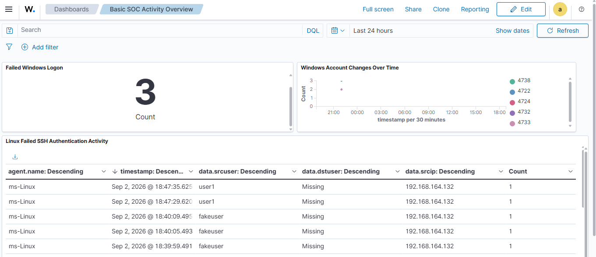

# SOC Dashboard

## Objective

The objective of this stage was to build and configure a SOC dashboard in Wazuh for monitoring authentication and account-related security activity across the lab environment.

---

## Dashboard Panels

The SOC dashboard contains the following monitoring panels:

### Failed Windows Logon

Monitors failed Windows login attempts to help identify unsuccessful authentication activity.

### Linux Failed SSH Authentication Activity

Monitors failed SSH authentication attempts on the Linux endpoint.

### Windows Account Changes Over Time

Provides a view of Windows account-related changes over time, helping monitor account activity within the Windows endpoint.

---

## Dashboard

---

## Purpose

The dashboard provides a centralized view of authentication and account-related activity across the monitored endpoints.

These panels can help during future SOC investigations by allowing an analyst to:

1. Identify failed authentication activity.
2. Review suspicious login attempts.
3. Monitor account-related changes.
4. Identify the affected endpoint.
5. Investigate relevant security events in Wazuh.

---
