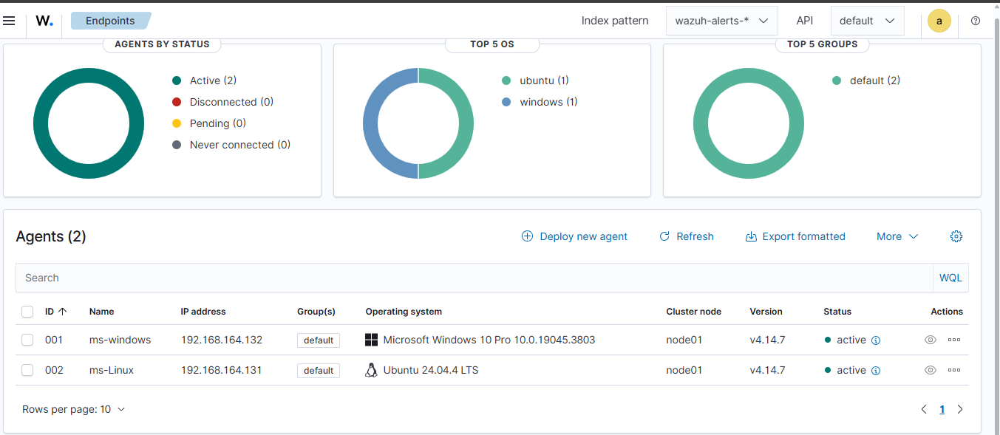
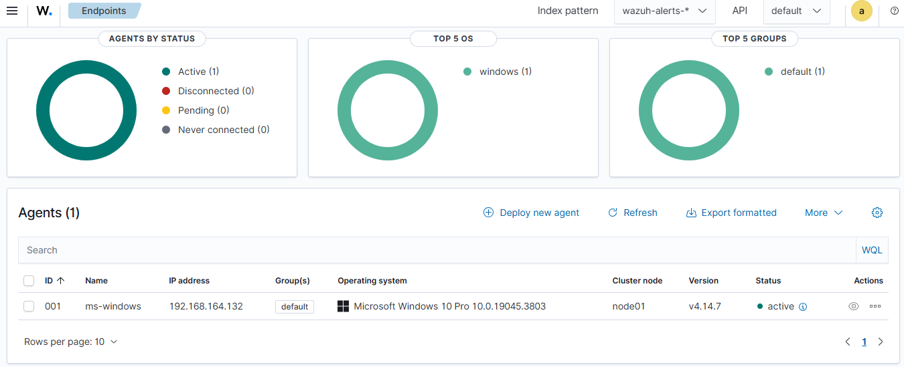

# Endpoint Agent Setup

## Objective

The second stage of the SOC home lab focused on connecting the Ubuntu and Windows 10 endpoints to the Wazuh Server.

Wazuh Agents were installed and configured on both endpoints to allow security-related telemetry to be collected and monitored centrally through the Wazuh platform.

---

## Lab Environment

| Component     | Role                       |
| ------------- | -------------------------- |
| Ubuntu Server | Wazuh Server               |
| Ubuntu        | Linux Endpoint             |
| Windows 10    | Windows Endpoint           |
| VMware        | Virtualization Platform    |
| Wazuh         | SIEM / Security Monitoring |

---

## 1. Ubuntu Endpoint

An Ubuntu virtual machine was configured as a monitored endpoint in the SOC lab.

The Wazuh Agent was installed and configured to communicate with the Wazuh Server.

After configuration, the Ubuntu endpoint was verified through the Wazuh Dashboard.

---

## 2. Windows 10 Endpoint

A Windows 10 virtual machine was configured as a second monitored endpoint.

The Wazuh Agent was installed and configured to communicate with the Wazuh Server.

The Windows endpoint was then verified through the Wazuh Dashboard.

---

## 3. Endpoint Connectivity

Both endpoints were successfully connected to the Wazuh Server.

The Wazuh Dashboard was used to verify the status of the connected agents.

The successful connection of both endpoints establishes the basic endpoint monitoring infrastructure required for the next stage of the SOC lab.

---

## Result

The Ubuntu and Windows 10 endpoints were successfully integrated with the Wazuh Server.

The current environment now consists of:

* One Wazuh Server
* One Ubuntu endpoint
* One Windows 10 endpoint
* Wazuh Agent installed on both endpoints
* Centralized endpoint monitoring through Wazuh

---
