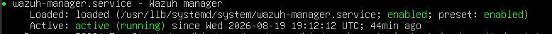
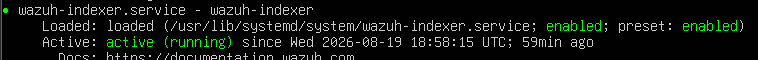
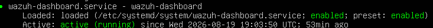
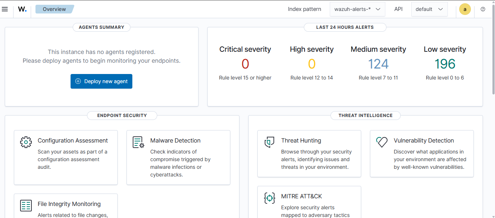

# Wazuh Server Setup

## Objective

The first stage of this SOC home lab was to deploy and configure a Wazuh server on an Ubuntu Server virtual machine running in VMware.

The Wazuh server will act as the central security monitoring platform for the lab and will later receive security telemetry from Ubuntu and Windows 10 endpoints.

---

## Lab Environment

| Component     | Role                                |
| ------------- | ----------------------------------- |
| VMware        | Virtualization platform             |
| Ubuntu Server | Wazuh Server                        |
| Ubuntu        | Linux Endpoint                      |
| Windows 10    | Windows Endpoint                    |
| Wazuh         | SIEM / Security Monitoring Platform |

---

## Wazuh Server Components

The Wazuh server deployment consists of the following main components:

* **Wazuh Manager** — Processes and analyzes security events received from agents.
* **Wazuh Indexer** — Stores and indexes security data.
* **Wazuh Dashboard** — Provides the web interface for monitoring and investigating security data.

---

## Installation

Wazuh was installed on the Ubuntu Server VM using the Wazuh installation assistant.

The following command was used:

```bash
curl -sO https://packages.wazuh.com/4.14/wazuh-install.sh
sudo bash ./wazuh-install.sh -a
```

The `-a` option was used for the all-in-one deployment of the Wazuh components.

---

## Service Verification

After completing the installation, the Wazuh services were checked to verify that the deployment was functioning correctly.

### Wazuh Manager

```bash
sudo systemctl status wazuh-manager
```

### Wazuh Indexer

```bash
sudo systemctl status wazuh-indexer
```

### Wazuh Dashboard

```bash
sudo systemctl status wazuh-dashboard
```

The Wazuh services were successfully configured, and the Wazuh Dashboard was accessible.





---

## Wazuh Dashboard

The Wazuh Dashboard was successfully accessed after completing the server installation.



The dashboard will be used in later stages to monitor endpoint activity, security events, alerts, and other security information.

---

